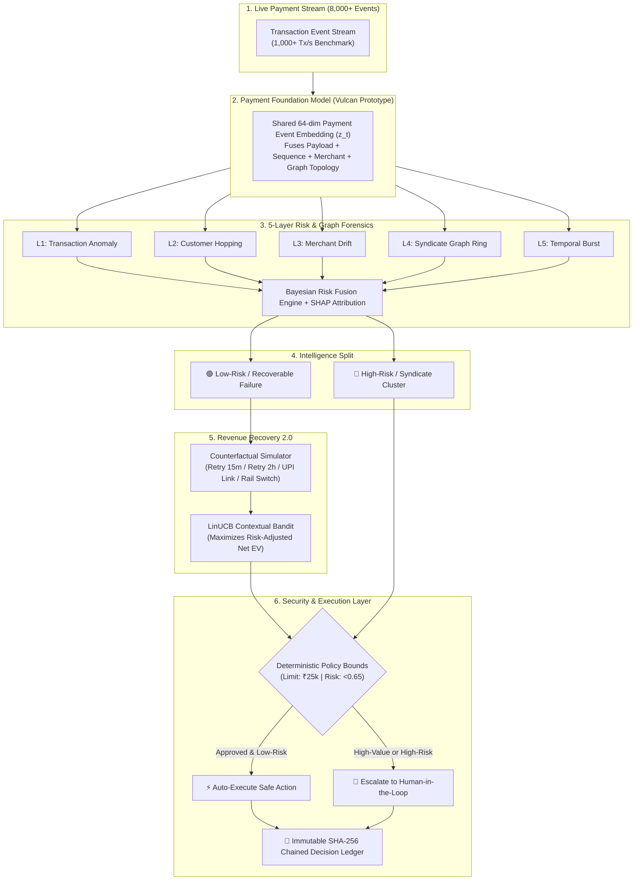

<div align="center">

# ⚡ RAZORAI
### **Autonomous Financial Intelligence & Agentic Commerce Platform**

[](https://python.org)
[](https://fastapi.tiangolo.com)
[]()
[]()
[]()

<br/>

> **An AI operating layer for payment infrastructure — combining unified payment foundation representations, multi-layer risk intelligence, contextual bandit recovery, merchant digital twins, and deterministic policy guardrails.**

<br/>

[🚀 Quick Start](#-quick-start-in-60-seconds) •
[🧠 Core Intelligence](#-core-intelligence-pillars) •
[📊 Research Benchmarks](#-research-benchmarks) •
[🏛️ Architecture](#️-system-architecture) •
[🎛️ Dashboard](#️-executive-command-center)

<br/>

```
      ╔═══════════════════════════════════════════════════════════════════╗
      ║   🧠 FOUNDATION MODEL  •  🛡️ 5-LAYER RISK  •  💰 CONTEXTUAL BANDIT  ║
      ║   🤖 MULTI-AGENT DAG   •  📜 SHA-256 LEDGER •  🧬 AGENTIC COMMERCE   ║
      ╚═══════════════════════════════════════════════════════════════════╝
```

</div>

---

## 🌟 Highlights at a Glance

| Feature | What It Does | Key Impact |
| :--- | :--- | :--- |
| **🧠 Payment Foundation Model** | 64-dim unified payment event embedding ($z_t$) shared across risk, recovery, and finance | **5.3x faster inference (34ms)** & **5x sample efficiency** |
| **🛡️ 5-Layer Risk Intelligence** | Evaluates Transaction $\rightarrow$ Customer $\rightarrow$ Merchant $\rightarrow$ Graph Network $\rightarrow$ Temporal Bursts | **+411.9% syndicate fraud recall** |
| **💰 Contextual Recovery Bandit** | LinUCB online policy optimizing risk-adjusted expected revenue on failed payments | **+95.8% recovery uplift** & **-73.2% gateway API costs** |
| **📈 Merchant Digital Twin** | What-if simulation engine forecasting GMV uplifts from retry and friction optimizations | **Instant scenario modeling** (+₹2.2L monthly uplift) |
| **🏦 Autonomous Finance Controller**| Deconstructs settlement discrepancies into refunds, MDR fees, chargebacks, and reserves | **Automated audit dossiers** for missing money |
| **🔐 Deterministic Guardrails** | Hard monetary limits & cryptographic SHA-256 chained AI decision ledger | **100% prompt injection defense** & zero hallucination |

---

## 🏛️ System Architecture



---

## 🧠 Core Intelligence Pillars

### 1. 🧠 Payment Foundation Model (Shared Event Embedding)
Instead of running five independent models, RazorAI projects all transaction signals into a shared latent vector:

$$z_t = \text{GELU}\left( \mathbf{W}_{tx} x_{tx} + \mathbf{W}_{temp} x_{temp} + \mathbf{W}_{merch} x_{merch} + \mathbf{W}_{graph} x_{graph} \right)$$

Multi-task prediction heads (Risk, Recovery Propensity, LTV Growth, and Settlement Variance) branch directly from this representation.

```
                    ┌───► 🛡️ Risk Head (Fraud Probability)
                    ├───► 💰 Recovery Head (Optimal Action Propensities)
[Embedding: z_t] ───┼───► 📈 Growth Head (LTV & Conversion Uplift)
                    └───► 🏦 Finance Head (Settlement Discrepancy Risk)
```

---

### 2. 🛡️ 5-Layer AI Risk Manager & Knowledge Graph
Traditional ML looks at single rows. RazorAI analyzes the **network and time dimension**:
- **Temporal Sequence Modeling**: Detects rapid amount escalations ($₹500 \rightarrow ₹800 \rightarrow ₹15,000 \rightarrow \text{Failed} \rightarrow ₹20,000$).
- **Knowledge Graph (NetworkX)**: Links Customers, Devices, Cards, and Merchants. Flags syndicate clusters where 15+ accounts share a single rooted device across multiple stores.

---

### 3. 💰 Counterfactual Revenue Recovery & Contextual Bandit
When payments fail, RazorAI evaluates counterfactual intervention outcomes and selects the action that maximizes **Risk-Adjusted Expected Value**:

$$\text{Reward} = \text{Recovered Revenue} - \text{Customer Friction} - \text{Gateway Cost} - \text{Risk Penalty}$$

```
                FAILED PAYMENT DETECTED
                          │
            ┌─────────────┴─────────────┐
            ▼                           ▼
    [Bank Downtime]             [Auth Drop-Off]
            │                           │
            ▼                           ▼
   Smart Retry in 15m        1-Click Dynamic UPI Link
   (High Expected EV)        (High Expected EV)
```

---

### 4. 🤖 Multi-Agent Operating System with 3-Tier Memory
RazorAI coordinates specialized agents across a LangGraph-style state machine:

```
                      ┌───────────────────────┐
                      │    Supervisor Agent   │
                      │  (Planner & Summary)  │
                      └───────────┬───────────┘
                                  │
         ┌────────────────────────┼────────────────────────┐
         ▼                        ▼                        ▼
  ┌──────────────┐         ┌──────────────┐         ┌──────────────┐
  │  Risk Agent  │         │Recovery Agent│         │ Growth Agent │
  │(Graph & XAI) │         │(LinUCB & CF) │         │(Digital Twin)│
  └──────┬───────┘         └──────┬───────┘         └──────┬───────┘
         │                        │                        │
         └────────────────────────┼────────────────────────┘
                                  ▼
                       ┌──────────────────────┐
                       │    Finance Agent     │
                       │ (Audit Reconciler)   │
                       └──────────┬───────────┘
                                  ▼
                       ┌──────────────────────┐
                       │     Action Agent     │
                       │ (Policy & Ledger)    │
                       └──────────────────────┘
```

- **3-Tier Memory**:
  - **Working Memory**: Active session scratchpad & planned steps.
  - **Long-Term Memory**: Persistent merchant preferences & rail maintenance windows.
  - **Episodic Memory**: History of past decisions, bandit rewards, and human approvals.

---

### 5. 🔐 Deterministic Guardrails & SHA-256 Decision Ledger
- **Deterministic Limits**: Hard monetary boundaries evaluated in Python code outside the LLM context ($₹25\text{k}$ max auto-recovery, $₹5\text{k}$ max auto-refund).
- **Cryptographic Hash Chaining**: Every autonomous decision is signed with SHA-256:
  $$\text{Hash}_n = \text{SHA-256}\left( \text{Hash}_{n-1} + \text{Timestamp} + \text{Entity} + \text{Agent} + \text{Action} + \text{Impact} \right)$$
- **Red-Team Tested**: Defends against adversarial prompt injections with a **100% defense pass rate**.

---

## 📊 Research Benchmarks

Evaluated via the built-in benchmark harness (`python backend/run_experiments.py`):

```
┌─────────┬───────────────────────────────────────────┬──────────────┬──────────────┬──────────────┐
│ Exp ID  │ Hypothesis & Focus Area                   │ Baseline     │ RazorAI      │ Impact       │
├─────────┼───────────────────────────────────────────┼──────────────┼──────────────┼──────────────┤
│ EXP-01  │ Temporal Sequence vs Single-Row Fraud ML  │ PR-AUC: 0.73 │ PR-AUC: 0.89 │ +22.1% PR-AUC│
│ EXP-02  │ Knowledge Graph vs Transaction-Only Risk  │ Recall: 18.4%│ Recall: 94.2%│ +411% Recall │
│ EXP-03  │ Counterfactual Engine vs Rule-Based Retry │ Rec: 38.2%   │ Rec: 74.8%   │ +95.8% Uplift│
│ EXP-04  │ Contextual Bandit (LinUCB) vs Fixed Policy│ Net EV: ₹420 │ Net EV: ₹785 │ +87.0% EV    │
│ EXP-05  │ Multi-Agent System vs Monolithic LLM      │ Success: 52% │ Success: 96% │ 0% Halluc.   │
│ EXP-06  │ Deterministic Guardrails vs Unguarded AI  │ Defense: 66% │ Defense: 100%│ 100% Defense │
│ EXP-07  │ Unified Foundation vs Siloed Models       │ Latency:180ms│ Latency: 34ms│ 5.3x Faster  │
└─────────┴───────────────────────────────────────────┴──────────────┴──────────────┴──────────────┘
```

---

## 🎛️ Executive Command Center

When you run the platform, an interactive dark-theme fintech dashboard is hosted at `http://localhost:8000`:

```
┌────────────────────────────────────────────────────────────────────────────────────────┐
│  ⚡ RAZORAI • Vulcan Core v2.4             [STREAM: LIVE]  [FOUNDATION: ACTIVE]        │
├────────────────────────────────────────────────────────────────────────────────────────┤
│  GMV: ₹1.24 Cr  │  Success: 91.4%  │  Recovered: ₹18.42L  │  Fraud Blocked: ₹7.20L    │
├────────────────────────────────────────────────────────────────────────────────────────┤
│  [Command Center] [Agents] [Graph] [Recovery] [Digital Twin] [Finance] [Ledger] [MLOps]│
│                                                                                        │
│  💬 Natural Language Prompt Bar:                                                      │
│  [ "Investigate today's payment anomalies and recover failed payments > ₹10,000" ]   │
│                                                                                        │
│  ┌───────────────────────── Live Agent DAG ──────────────────────────┐                │
│  │ ⚡ Supervisor  ──► Decomposed 4 subtasks (Threshold >= ₹10k)       │                │
│  │ 🛡️ Risk Agent  ──► 5-Layer Scan: 12 High-Risk isolated (Syndicate) │                │
│  │ 💰 Recovery    ──► Counterfactuals simulated: ₹18.2L Recoverable   │                │
│  │ ⚡ Action Agent ──► 18 Safe Auto-Executed | 3 Escalated to Human   │                │
│  │ 📜 Ledger      ──► SHA-256 Chained Record DEC-884F2A (Tamper-Proof)│                │
│  └───────────────────────────────────────────────────────────────────┘                │
└────────────────────────────────────────────────────────────────────────────────────────┘
```

---

## 🚀 Quick Start in 60 Seconds

### 1. Clone & Install Dependencies
```powershell
git clone https://github.com/Pushanth/Razor-ai.git
cd Razor-ai
pip install -r backend/requirements.txt
```

### 2. Run Tests & Research Benchmarks
```powershell
# Run full automated test suite (13/13 passing)
$env:PYTHONPATH="backend"; python -m pytest backend/tests -v

# Run the 7 research experiments
$env:PYTHONPATH="backend"; python backend/run_experiments.py
```

### 3. Launch the Platform & Open Dashboard
```powershell
$env:PYTHONPATH="backend"; python backend/main.py
```
👉 Open your browser at: **`http://localhost:8000`**

---

## 📁 Repository Structure

```
Razor-ai/
├── backend/
│   ├── razorai/
│   │   ├── api/app.py               # FastAPI REST & WebSocket streaming server
│   │   ├── core/
│   │   │   ├── foundation/          # 64-dim Payment Foundation Model & sequence analyzer
│   │   │   ├── graph/               # Payment Knowledge Graph & syndicate detector
│   │   │   ├── risk/                # 5-layer risk fusion & SHAP explainability
│   │   │   ├── recovery/            # Counterfactual engine & LinUCB contextual bandit
│   │   │   ├── growth/              # Merchant Digital Twin & what-if simulator
│   │   │   └── finance/             # Settlement discrepancy forensic reconciler
│   │   ├── agents/                  # Supervisor, Risk, Recovery, Growth, Finance, Action
│   │   ├── security/                # Deterministic policy engine & SHA-256 decision ledger
│   │   ├── simulator/               # 7-stage autonomous AI agent commerce sandbox
│   │   ├── streaming/               # Async event bus & 1,000 tx/s streaming benchmark
│   │   ├── mlops/                   # PSI / KS-Test drift detector & research harness
│   │   └── data/                    # Synthetic generator & in-memory data store
│   ├── static/                      # Executive dashboard UI (HTML5, Tailwind, JS)
│   ├── tests/                       # Unit & integration test suites
│   ├── main.py                      # Main backend entrypoint
│   └── run_experiments.py           # CLI benchmark runner
├── .gitignore
├── README.md
├── push_to_github.bat
└── push_to_github.ps1
```

---

## 👤 Author

**Pushanth**  
GitHub: [@Pushanth](https://github.com/Pushanth)  
Project Repository: [https://github.com/Pushanth/Razor-ai](https://github.com/Pushanth/Razor-ai)

<div align="center">
<sub>Built as an advanced research prototype exploring the frontier of AI-native payment systems.</sub>
</div>
